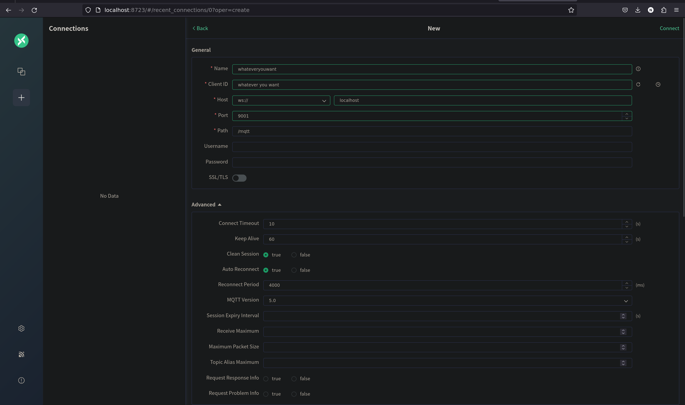

# Docker

Today we're demonstrate the power of using docker to easily deploy services that talk to eachother.

Inside of this directory is a Dockerfile and a docker-compose. the docker compose file is preconfigured to start an MQTT broker
that you can talk to, in addition to a web GUI frontend to visualize any messages being sent. Don't worry about configuring
the broker, it is already done for you.

# Your task

Create a Dockerfile that can communicate with the MQTT broker, and integrate it into the docker compose.
You should be able to publish a message from your new container and see it in the web GUI.

## What is MQTT?

MQTT is a super simple protocol for sending and receiving data. We actually are using it on the car for telemetry!
It is a publisher-subscriber model, meaning that nodes in the network can either publish to a certain topic, or
subscribe to a certain topic to receive all data published. Don't worry about the lower level protocols, this info
should be sufficient for now.

## Launching the Docker Compose and Viewing MQTT traffic

Run `docker compose up --build` to begin running the whole compose.  The `--build` flag specifies that we want to rebuild any sources we use. This will start the broker and the frontend by default. If you need to run it in "detached" mode, or gain access to the CLI and run it in the background, add the `-d` flag at the end.

### Viewing the Frontend

1. Start the docker compose
2. Go to `localhost:8723`
3. Click on the "+" in the right hand corner to add a new broker
4. Fill in the fields shown in the image above (Note, only things that matter really are the broker address and the port)
5. Now you can publish and subscribe to any messages you'd like!

# Hints

- If you run the docker compose in detached, you can attach yourself to the terminal in one of the containers using:
`docker exec -it <CONTAINER_NAME> /bin/bash`. The `docker compose -d` output show the container names

- If you run the docker compose in detached mode, you can shut them down by running `docker compose down`

- `mosquitto-clients` is a super helpful CLI package for testing MQTT brokers. Probably include this in your dockerfile.
You can find more info on Google. Specifically, the command `mosquitto_pub -t 'whatever/topic/you/want' -m "MY MESSAGE"` might be of use. The port you want to publish to is `1883` and the hostname to publish to is `mosquitto` in our compose's setup

- You probably want to subscribe to a specific message in MQTTX. You can subscribe to a topic and all of its subtopics by using a wildcard of `thistopic/#`
